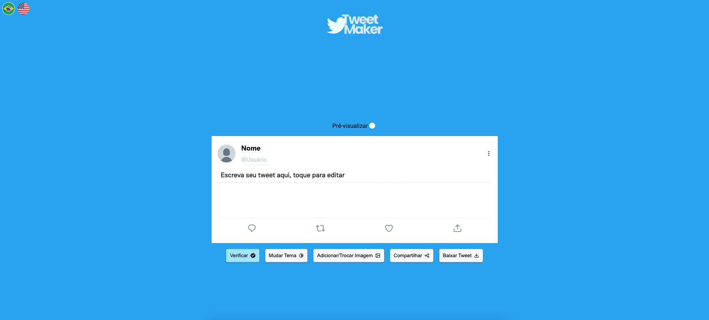

# Tweet Maker

<div align="center">


</div>

---

[EN Version](./README-EN.md)
### Demonstração: https://wesleymaik.github.io/tweet-maker

Um simples gerador de Tweets falsos simples, fácil e usual.

Faça seu usuário ser verificado, troque o tema, adicione imagem, compartilhe com os amigos e baixe como uma imagem se preferir.



---

## Clonar o projeto

Requisitos 
- Node >= v16.14.1
- Git

### Clone
```
git clone https://github.com/WesleyMaik/tweet-maker
```

### Instalando dependências
```
npm install
```
ou
```
yarn install
```

### Rodando
```
npm run dev
```
ou
```
yarn dev
```

---

"Twitter" e "Tweet" são marcas registradas do Twitter, Inc. Tweet Maker não é afiliado de forma alguma ao Twitter, Inc.

---

[License](./LICENSE)